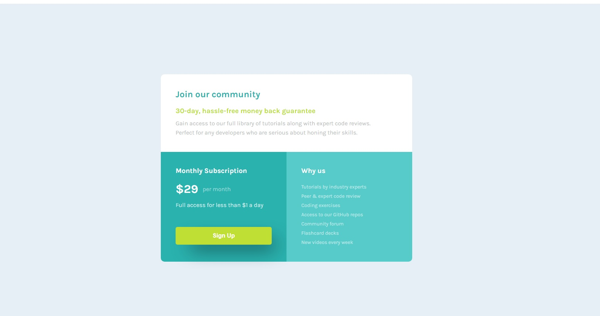
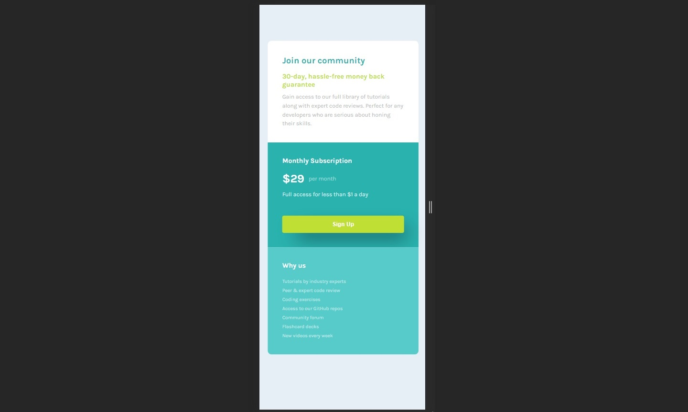

# Frontend Mentor - Single price grid component solution

This is a solution to the [Single price grid component challenge on Frontend Mentor](https://www.frontendmentor.io/challenges/single-price-grid-component-5ce41129d0ff452fec5abbbc). Frontend Mentor challenges help you improve your coding skills by building realistic projects. 
 

# 📋 Index

- [Overview](#overview)
  - [The challenge](#the-challenge)
  - [Screenshot](#screenshot)
  - [Links](#links)
- [Built with](#built-with)
- [License](#license)
- [Author](#author)
---
# 📄 Overview

### The challenge

Users should be able to:

- View the optimal layout for the component depending on their device's screen size
- See a hover state on desktop for the Sign Up call-to-action

### Screenshot
  - Desktop
  

  - Mobile
  

### Links

- [Solution URL](https://www.frontendmentor.io/solutions/responsive-layout-html-and-css-flexbox-wA2xKVU4m)
- [Live Site URL](https://willian-souza.github.io/Frontend-Mentor-Column-Preview-Card/)
---
# 🖥 Built with

- Semantic HTML5 markup
- CSS custom properties
- Flexbox
- CSS Grid
---
# 📝 License
This project is under license MIT. See the archive [LICENSE](/LICENSE) for more details.

---
## Author
Developed by Willian dos Santos Souza
- [LinkedIn](https://www.linkedin.com/in/willian-ssouza/) 
- [Frontend Mentor](https://www.frontendmentor.io/profile/willian-souza)

